# Manual de Usuario — App Contable

Este manual explica cómo usar cada módulo de la aplicación. Para instalarla,
revisa primero el **Manual de instalación** en el [README](README.md).

Las capturas usan los datos de prueba de agosto 2026 que se cargan con
`npm run migrate`.

## Contenido

1. [Acceso al sistema](#1-acceso-al-sistema)
2. [Dashboard](#2-dashboard)
3. [Libro Diario](#3-libro-diario)
4. [Plan de Cuentas y Libro Mayor](#4-plan-de-cuentas-y-libro-mayor)
5. [Kardex (inventario)](#5-kardex-inventario)
6. [Cierre e Impuestos](#6-cierre-e-impuestos)
7. [Reportes Financieros](#7-reportes-financieros)
8. [Flujo recomendado del ciclo contable](#8-flujo-recomendado-del-ciclo-contable)
9. [Preguntas frecuentes](#9-preguntas-frecuentes)

---

## 1. Acceso al sistema

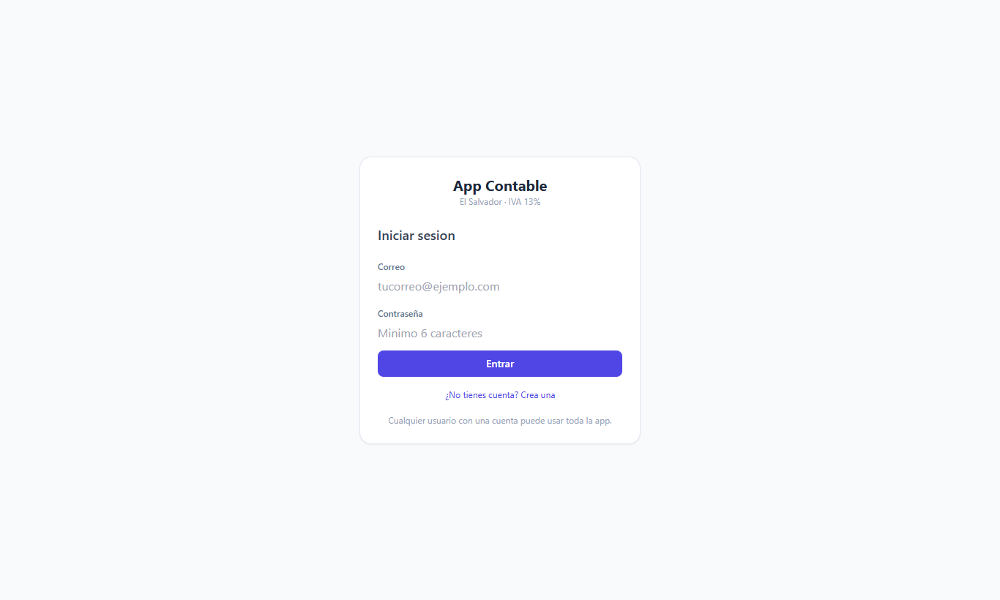

**Primera vez (crear cuenta)**

1. Abre `http://localhost:3000` en el navegador.
2. Da clic en **¿No tienes cuenta? Crea una**.
3. Escribe tu correo y una contraseña de **al menos 6 caracteres**.
4. Da clic en **Crear cuenta**. Entrarás directamente a la aplicación.

**Las siguientes veces:** escribe tu correo y contraseña y da clic en **Entrar**.

- La sesión dura 7 días; después el sistema pide iniciar sesión de nuevo.
- Para salir, usa **Cerrar sesión** en la esquina inferior izquierda.
- Todos los usuarios tienen acceso completo a todos los módulos (ver la Tabla
  de Roles en el README).

El menú de la izquierda lleva a cada módulo: **Dashboard, Libro Diario, Plan de
Cuentas / Mayor, Kardex, Cierre e Impuestos y Reportes**.

---

## 2. Dashboard

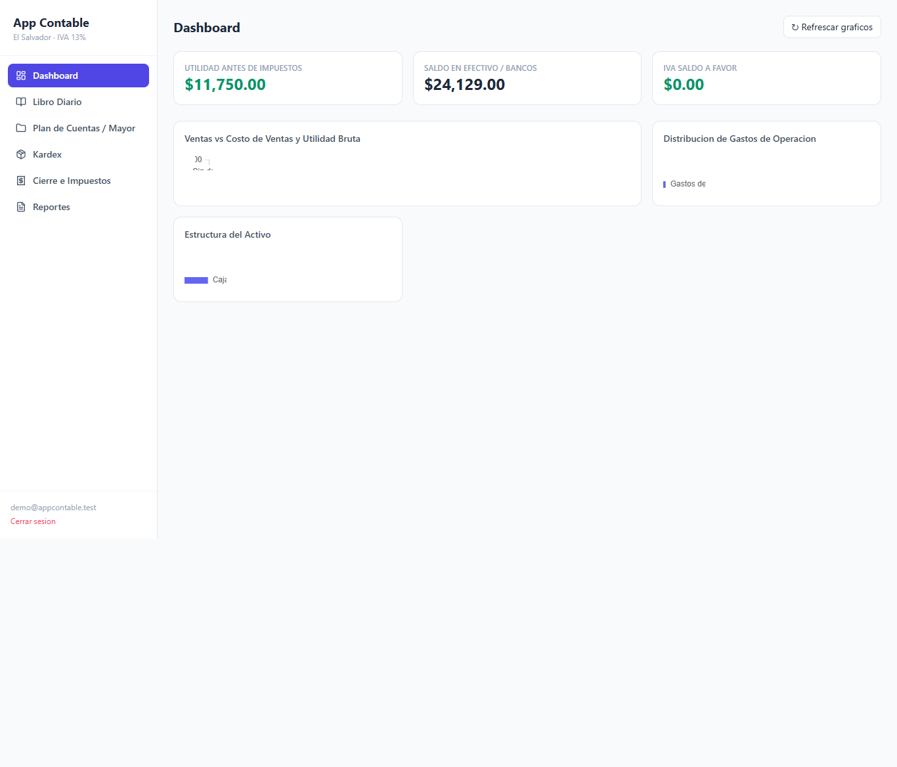

Es la pantalla de inicio. Muestra un resumen de la empresa calculado con los
saldos de las cuentas:

| Elemento | Qué muestra |
|---|---|
| **Utilidad antes de impuestos** | Ingresos (código 5) − Costos y Gastos (código 4). |
| **Saldo en efectivo / bancos** | Suma de Caja y Bancos. |
| **IVA saldo** | IVA por pagar o a favor del período. |
| **Ventas vs Costo de Ventas y Utilidad Bruta** | Gráfico de barras por mes. |
| **Distribución de Gastos de Operación** | Qué porcentaje representa cada gasto. |
| **Estructura del Activo** | Cómo se reparte el activo entre sus cuentas. |

Da clic en **Refrescar gráficos** después de registrar partidas para ver los
datos actualizados.

---

## 3. Libro Diario

Aquí se registran todas las transacciones como **partidas dobles**.

### 3.1 Registrar una partida

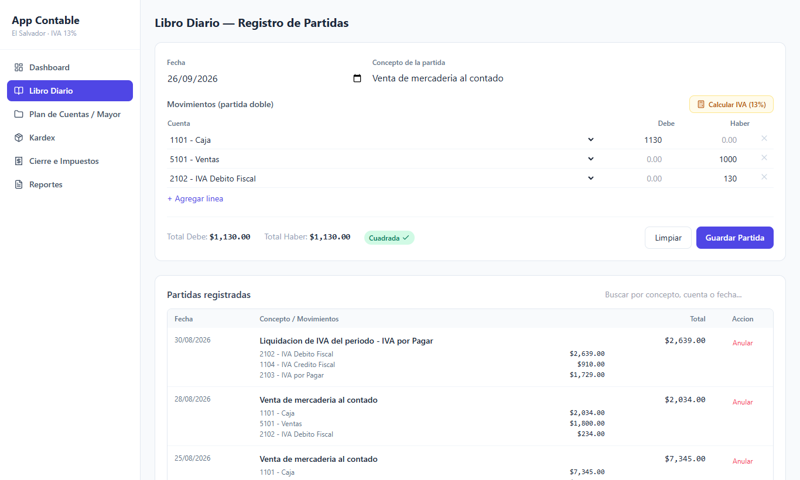

1. Elige la **Fecha** y escribe el **Concepto** (por ejemplo, *Venta de
   mercadería al contado*).
2. En **Movimientos**, elige una **Cuenta** en cada línea y escribe su monto en
   **Debe** o en **Haber**.
3. Usa **+ Agregar línea** si necesitas más cuentas, o la **×** para quitar una.
4. Revisa los totales: cuando Debe = Haber aparece la etiqueta verde
   **Cuadrada ✓**.
5. Da clic en **Guardar Partida**.

Al guardar, el sistema **mayoriza automáticamente**: actualiza el saldo de cada
cuenta usada, sin cálculos manuales.

> **Calcular IVA (13 %):** abre una calculadora que, a partir del valor sin IVA,
> te da el IVA y el total. Útil para compras y ventas gravadas.

### 3.2 Validación de partida doble

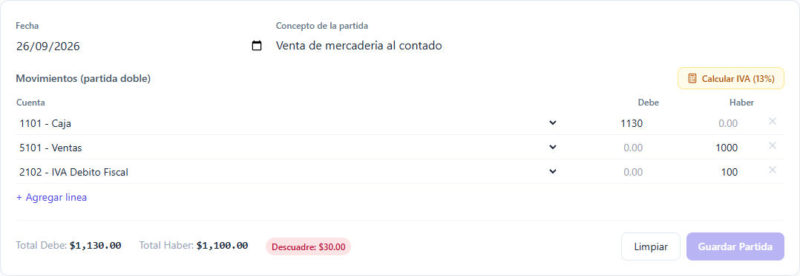

Si el Debe y el Haber **no son iguales**, aparece en rojo el monto del
**Descuadre** y el botón **Guardar Partida se desactiva**. El sistema no permite
guardar una partida que no cumpla la partida doble. La base de datos también lo
valida, así que no hay forma de registrar un asiento descuadrado.

### 3.3 Consultar y anular partidas

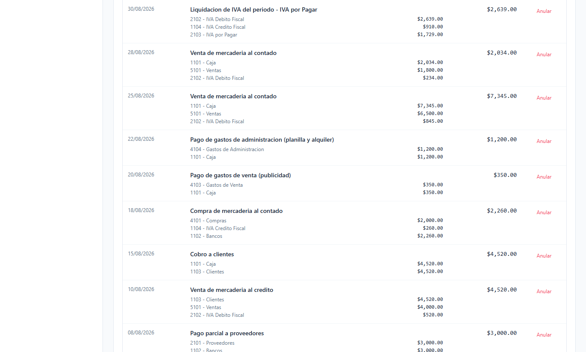

- En **Partidas registradas** se ven todas las partidas con sus movimientos,
  de la más reciente a la más antigua.
- Usa el buscador para filtrar por concepto, cuenta o fecha.
- **Anular** revierte el efecto de la partida en los saldos de las cuentas. La
  partida no se borra: queda marcada como anulada para mantener el historial.

---

## 4. Plan de Cuentas y Libro Mayor

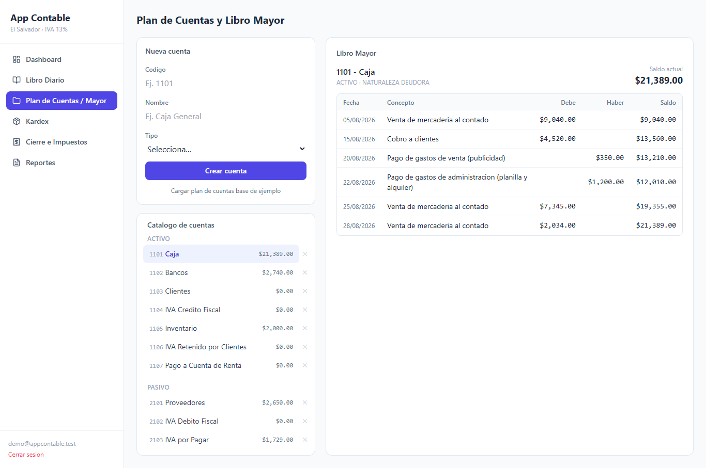

### 4.1 Catálogo de cuentas

El catálogo se agrupa por el **primer dígito del código**, que es lo que usan
los reportes para clasificar cada cuenta:

| Dígito | Grupo | Aparece en |
|---|---|---|
| 1 | Activo | Balance General |
| 2 | Pasivo | Balance General |
| 3 | Capital | Balance General |
| 4 | Costos y Gastos | Estado de Resultados |
| 5 | Ingresos | Estado de Resultados |

**Crear una cuenta:** en **Nueva cuenta** escribe el **Código** (respetando el
dígito del grupo), el **Nombre** y el **Tipo**, y da clic en **Crear cuenta**.

**Eliminar una cuenta:** con la **×** al lado de la cuenta. Solo se permite si su
saldo es cero.

**Cargar plan de cuentas base de ejemplo:** crea un catálogo típico de una
empresa comercial salvadoreña (no duplica las cuentas que ya existen).

### 4.2 Libro Mayor

Da clic en cualquier cuenta del catálogo para ver su **Libro Mayor**: todos sus
movimientos ordenados por fecha, con el Debe, el Haber y el saldo acumulado
después de cada movimiento. Arriba se indica la naturaleza de la cuenta
(deudora o acreedora) y el saldo actual.

---

## 5. Kardex (inventario)

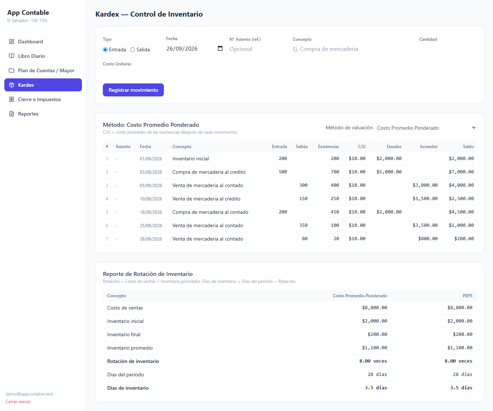

### 5.1 Registrar un movimiento

1. Elige **Entrada** (compra) o **Salida** (venta).
2. Escribe la **Fecha**, el **N° de asiento** de referencia (opcional), el
   **Concepto** y la **Cantidad**.
3. Para una entrada, escribe también el **Costo unitario**. En las salidas el
   costo lo calcula el sistema según el método.
4. Da clic en **Registrar movimiento**.

### 5.2 Método de valuación

Con el selector **Método de valuación** puedes ver el mismo inventario con:

- **Costo Promedio Ponderado:** cada salida se valora al costo promedio de lo
  que hay en existencia.
- **PEPS (Primeras Entradas, Primeras Salidas):** las salidas se toman de los
  lotes más antiguos. Debajo de cada movimiento se muestran los lotes que quedan.

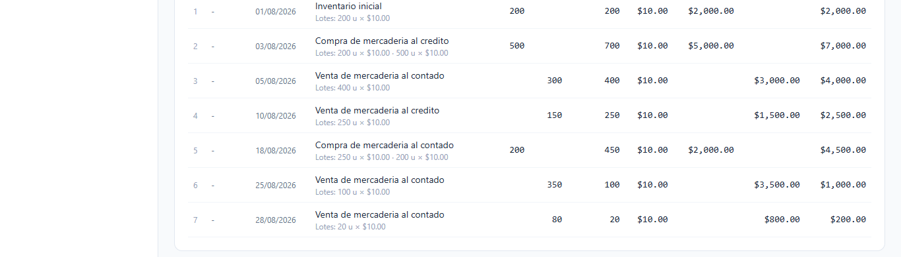

---

## 6. Cierre e Impuestos

### 6.1 Liquidación de IVA

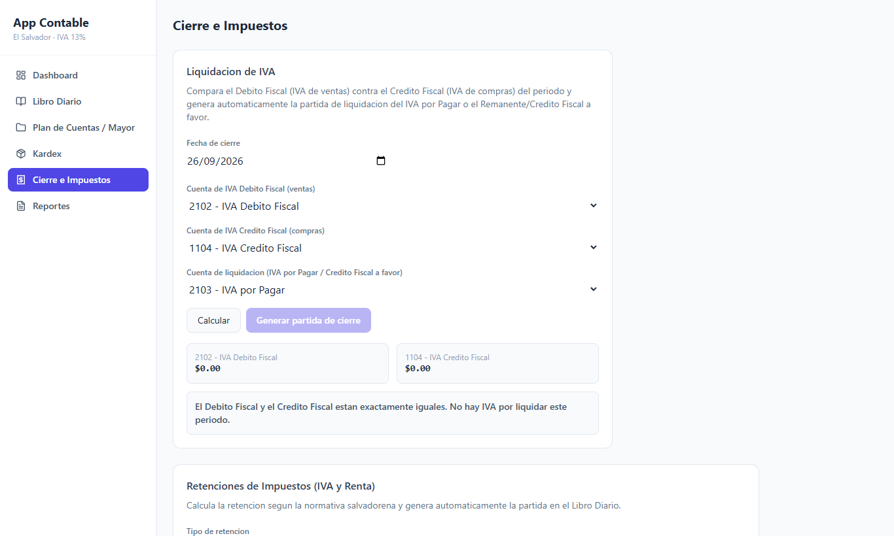

Compara el **Débito Fiscal** (IVA de ventas) con el **Crédito Fiscal** (IVA de
compras) y genera la partida de liquidación.

1. Elige la **Fecha de cierre**.
2. Selecciona las cuentas: **IVA Débito Fiscal** (2102), **IVA Crédito Fiscal**
   (1104) y la **cuenta de liquidación** (2103 IVA por Pagar, o una cuenta de
   remanente a favor).
3. Da clic en **Calcular**. El sistema indica si hay **IVA por pagar**
   (Débito > Crédito) o **remanente a favor** (Crédito > Débito).
4. Da clic en **Generar partida de cierre**. La partida se registra sola en el
   Libro Diario.

> En los datos de prueba el IVA de agosto ya está liquidado; por eso la captura
> muestra ambos saldos en $0.00 y el botón desactivado.

### 6.2 Retenciones de impuestos (IVA y Renta)

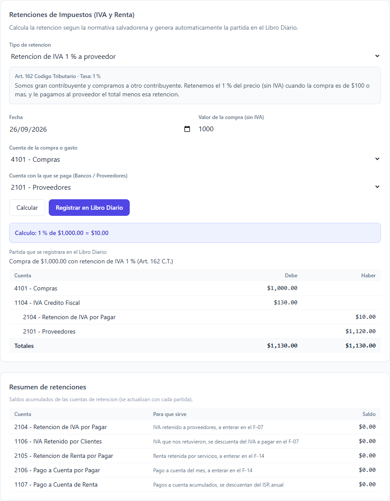

Calcula retenciones según la normativa salvadoreña y genera la partida completa.

| Tipo | Tasa | Base legal | Cuándo se usa |
|---|---|---|---|
| **Retención de IVA a proveedor** | 1 % | Art. 162 Código Tributario | Somos gran contribuyente y compramos a otro contribuyente por **$100 o más**. |
| **IVA retenido por cliente** | 1 % | Art. 162 Código Tributario | Vendemos a un gran contribuyente por **$100 o más** y él nos retiene. |
| **Retención de Renta por servicios** | 10 % | Art. 156 Ley de ISR | Pagamos servicios (honorarios, comisiones) a una persona natural. |
| **Pago a cuenta** | 1.75 % | Art. 151 Código Tributario | Anticipo mensual del ISR sobre los ingresos brutos. |

**Pasos:**

1. Elige el **Tipo de retención**. Debajo aparece una explicación y la tasa.
2. Escribe la **Fecha** y el **monto base** (sin IVA). En *Pago a cuenta* la base
   se llena sola con el total de ingresos (código 5), pero puedes cambiarla.
3. Revisa las cuentas sugeridas (por ejemplo, *Compras* y *Proveedores*) y
   cámbialas si la operación usa otras.
4. Da clic en **Calcular**. Se muestra el cálculo y la **partida completa** que
   se registrará, con sus totales cuadrados.
5. Da clic en **Registrar en Libro Diario**.

Si una operación de IVA es menor de $100, el sistema avisa que **no aplica
retención** según el Art. 162.

**Resumen de retenciones:** muestra el saldo acumulado de cada cuenta de
retención y en qué formulario se declara (**F-07** para IVA, **F-14** para
retenciones de renta y pago a cuenta).

> Si tu base de datos se creó antes de este módulo, aparecerá un aviso con el
> botón **Crear cuentas de retención**, que agrega al catálogo las cuentas
> 1106, 1107, 2104, 2105, 2106 y 4105.

---

## 7. Reportes Financieros

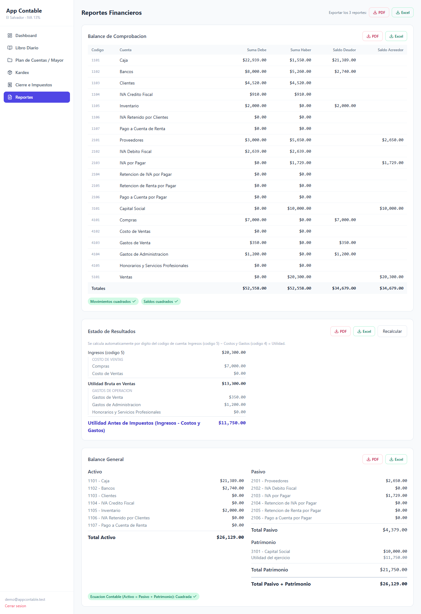

Los tres reportes se generan **automáticamente** a partir de los saldos de las
cuentas, clasificándolas por el primer dígito del código.

### 7.1 Balance de Comprobación

Lista cada cuenta con sus sumas de Debe y Haber y su saldo deudor o acreedor.
Abajo aparecen dos indicadores:

- **Movimientos cuadrados:** la suma total del Debe es igual a la del Haber.
- **Saldos cuadrados:** los saldos deudores suman lo mismo que los acreedores.

### 7.2 Estado de Resultados

**Ingresos (código 5) − Costos y Gastos (código 4) = Utilidad.** Muestra por
separado el Costo de Ventas, la Utilidad Bruta, los Gastos de Operación y la
Utilidad antes de impuestos. El botón **Recalcular** lo vuelve a generar.

### 7.3 Balance General

**Activo (código 1) = Pasivo (código 2) + Capital (código 3).** La utilidad del
ejercicio se suma al patrimonio. La etiqueta **Ecuación contable: Cuadrada**
confirma que el balance cumple la ecuación.

### 7.4 Exportar a PDF o Excel

Cada reporte tiene botones **PDF** y **Excel**. Arriba, **Exportar los 3
reportes** descarga los tres juntos.

| Formato | Qué obtienes |
|---|---|
| **PDF** | Documento listo para imprimir con encabezado, fecha de generación y páginas numeradas. Con "los 3 reportes", cada uno va en su propia página. |
| **Excel (.xlsx)** | Una hoja por reporte. Las cifras quedan como números con formato de dólar, así que puedes sumarlas o hacer gráficos en Excel. |

Los archivos se guardan en la carpeta de **Descargas** con el nombre del reporte
y la fecha, por ejemplo `Balance_General_2026-09-26.pdf`.

> Las librerías de exportación se cargan desde internet. Sin conexión, el botón
> muestra un aviso en lugar de descargar.

---

## 8. Flujo recomendado del ciclo contable

1. **Plan de Cuentas:** revisa que existan las cuentas que vas a usar.
2. **Libro Diario:** registra cada transacción del período como partida doble.
3. **Kardex:** registra las entradas y salidas de mercadería.
4. **Retenciones:** registra las compras, ventas o servicios con retención.
5. **Libro Mayor:** revisa los movimientos y saldos de las cuentas.
6. **Cierre:** liquida el IVA del período.
7. **Reportes:** verifica que el Balance de Comprobación y el Balance General
   estén cuadrados y exporta los estados financieros a PDF o Excel.

---

## 9. Preguntas frecuentes

| Pregunta | Respuesta |
|---|---|
| No me deja guardar la partida. | Debe = Haber no se cumple. Revisa la etiqueta de descuadre y corrige los montos. |
| Me equivoqué en una partida ya guardada. | Anúlala desde **Partidas registradas** y regístrala de nuevo correctamente. |
| Una cuenta nueva no aparece en el reporte correcto. | Revisa que el primer dígito del código corresponda a su grupo (tabla de la sección 4.1). |
| El Balance General dice "NO cuadrada". | Revisa que las cuentas estén bien codificadas y que no haya partidas registradas con cuentas de tipo incorrecto. |
| No puedo eliminar una cuenta. | Solo se eliminan cuentas con saldo cero. |
| El sistema me pide iniciar sesión de nuevo. | La sesión expira a los 7 días. Vuelve a entrar con tu correo y contraseña. |
| Los botones PDF / Excel muestran un error. | Revisa tu conexión a internet y recarga la página. |
